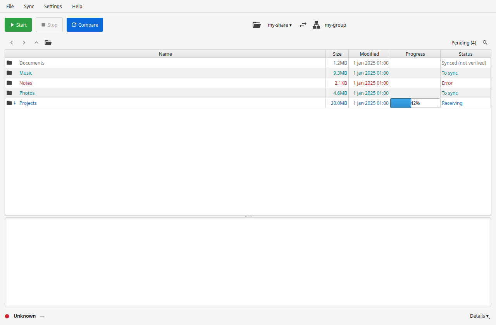
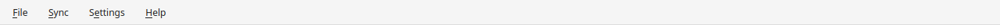
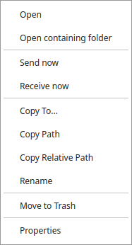
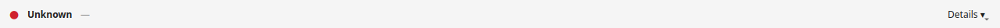
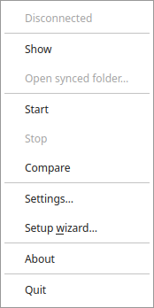

# A tour of the window

This page shows what you see when HSYNC Desktop is open, so the rest of the
documentation can refer to each part by name. You do not have to read it before
using the app — it is here to answer "what is that icon?".

## The menu bar

- **File** — actions on the file or folder you selected (open, copy, rename, …)
  and **Quit** at the bottom.
- **Sync** — start, compare and stop, **Send now** / **Receive now** for one
  selection, and the sync direction.
- **Settings** — the configuration dialog; see the
  [Configuration Reference](configuration.md).
- **Help** — this documentation, the [Setup wizard](setup-wizard.md) to re-run
  the guided setup, the project on GitHub, the license and **About** (which shows
  the app and engine versions).

On macOS the same items live in the application menu, as usual on a Mac.

## The toolbar

The three buttons on the left are the everyday controls:

| Button | What it does |
| ------ | ------------ |
| ▶ **Start** | Begins syncing. A confirmation shows the plan before anything happens. To see that plan without starting a sync, use **Sync → Compare**. |
| ■ **Stop** | Stops the running sync; while it winds down the status shows `Stopping…` and the buttons stay disabled until it has exited. |
| 🔄 **Compare** | Shows what a sync would do: it compares your folder with the other devices and updates the list, whether or not a sync is running. While a comparison runs it is disabled; before a connection exists it explains that the comparison starts on its own. |

**Compare** is the one way to ask *what would be synced?* With the sync
stopped it runs a preview and offers **Sync now**; with the sync running it compares
over the live connection. `F5` and `Ctrl+Shift+P` both reach it.

## The path bar

The path bar tells you **what** you are looking at and **where it goes**:

- the **folder icon** with the **share name** (here `my-share`) opens the shared
  folder in your file manager when you click it; the tooltip shows the folder's
  full path on this computer;
- the **⇄** and the remote icon with the connection (here `my-group`) name
  the other side: a peer group in **p2p Mode**, or the server in **Server Mode**.
  If you left the group name empty, the bar shows `No group`: the peer set is
  every other device that also has no group.

The **←**, **→** and **↑** arrows below the toolbar move through sub-folders, and
the folder button returns to the shared folder's root.

## The file list

The file list shows every file the sync is working on, one row each, with the
folder tree above it. Columns are resizable and reorderable; the header menu
toggles the optional columns and can reset the layout. **Only changes** filters
the list to the rows with pending work and shows how many there are.
Right-clicking a row opens the actions for that file or folder. The full description is in
[The file list](file-list.md).

## The log panel

The **Log** panel at the bottom shows the sync engine's own messages while it
runs, interleaved with the app's own status lines (the ones whose source is
`[desktop]`: a comparison starting or ending, the plan being prepared, the
engine exiting). Both are written in the same
`<timestamp> - [<pid>] [<source>] LEVEL: message` shape, in UTC, so a single
reading covers the whole panel. You do not need it for normal use; it is the
first place to look when something does not work.

The panel **keeps the lines of previous runs**: a new sync opens with a
`--- Sync started ---` marker and appends below it, so the history of the
session stays readable. Right-click the panel and choose **Clear Log** to empty
it. The labels are explained in [Log Labels](log-labels.md), and you can hide the
panel from **Settings → General**.

## The status bar

The bottom bar answers the two questions that matter, left to right:

- **Are we connected?** — the coloured dot and its label (`Connecting…`,
  `Syncing…`, `Stopping…`, `Connected`, …).
- **Is everything in sync?** — `All files in sync`, `2 to download · 1 to send`,
  `No devices`, `Checking…` and the other states described in
  [Warnings and notifications](warnings.md). While it names pending work, clicking
  it compares.

On the right it keeps the badges that explain an active behaviour —
**Simulation — no changes**, **Deletions kept** — the **⚠ problems** badge, and
**Details ▾**, which opens the rest: the share size, the primary/secondary role
(p2p), the group, the participating devices and the session totals
(`↑ Sent` / `↓ Received`, files and bytes). The bandwidth limits are editable
from there too (or by clicking the sent/received values).

## Closing the window and the tray

Closing the window **does not stop a running sync**: the app keeps working from
the system-tray icon. The menu names the current state and offers the everyday
shortcuts: **Show** to bring the window back, **Open synced folder** to reach the
files without restoring it, the run controls, **Settings** and the **Setup
wizard**, **About**, and **Quit** (which asks for confirmation while a sync runs).
On a desktop without a system tray, closing the window really closes the app (and
still asks before stopping a run).

## Where to go next

- [Your first sync](first-sync.md) — set up and run once, end to end.
- [Start, watch and stop a sync](sync-basics.md) — the everyday tasks.
- [Key concepts](concepts.md) — the words the app uses (share, group, primary…).
